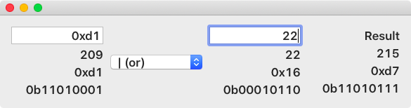
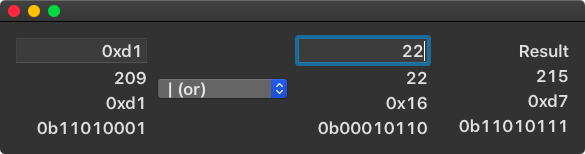

# Hexadec
A Mac app to easily convert between hexadecimal and decimal integers.

# Screenshots

# Why?

I know that the calculator shipping with macOS can do all this out of the box.
But I needed to click to switch between decimal and hexadecimal.

# Author

Dominik Hauser

[@dasdom](https://twitter.com/dasdom)

[Blog](https://dasdom.dev)

# Licence

MIT
